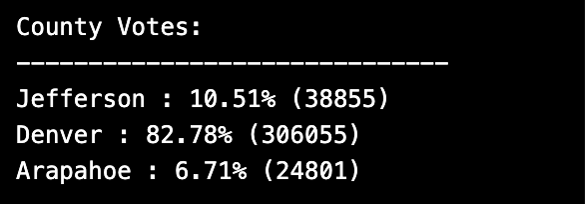
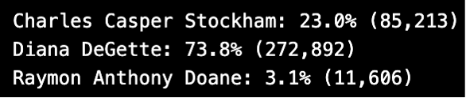

# Election-Analysis
Outcomes based on analysis of Election Data
## Overview of Election Audit:
The client has provided a csv file of the election data. They are interested in viewing the results (in terminal and in a text file). In the [Python File](https://github.com/lindsayrosenthal/Election-Analysis/blob/main/PyPoll_Challenge.py), there is code to populate the information for:
1. Total number of votes
2. The name, percentage of total votes, and total votes by each county.
3. The name, percentage of total votes, and total votes for each candidate.
4. The name, winning vote count, and winning percentage of the winner of the election.
## Election-Audit Results:

- [Full Results Text File](election_analysis.txt)
#### Total Votes

1. To get the total number of votes, we need to initialize a variable and create a for loop to add 1 each time the loop iterates through a row:
  - total_votes = 0  
    - for row in csv:
     - total_votes += 1
      - print(total_votes)
#### Votes by County

2. County vote info:
  - To get the number of votes for each county, we need to set a variable and retrieve the information within a for loop that will iterate through each county.
    - for county in county_votes:
      - county_vote_count = county_votes(county)
  - To get percentage:
      - vote_percentage_county = float(county_vote_count)/float(total_votes)*100
#### Largest County Turnout

3. To find the largest county you use an if statement to determine if its the largest. It will go through the list and change the largest county vote to the highest number it finds.
  - if (county_vote_count>largest_county_votes):
    - largest_county_votes = county_vote_count  - because after this runs that variable will be the largest.
    - largest_county_turnout = county - this creates the variable based on the county associated with the largest number.
#### Votes by Candidate

4. Candidate vote info:
  - To get the number of votes for each candidate, it will be similar to number 2 while using the get method:
    - for candidate_name in candidate_votes:
       - votes = candidate_votes.get(candidate_name)
  - To get percentage:
       - vote_percentage = float(votes)/float(total_votes)*100
### Winning Candidate

5. Winning Candidate info: using an if statement and logical operator 'and':
  - if (votes > winning_count) and (vote_percentage > winning_percentage):
    - winning_count = votes
    - winning_candidate = candidate_name
    - winning_percentage = vote_percentage
## Election Audit Summary
- This script can be recycled to inform the client of the results of multiple elections.
- If you had a csv with different information:
  - you can set the variables to match your new file.
- For Ex. - total votes
 - upload and open your new csv in place of the current election data.
 - make sure when you want to create variables. pull the correct index number for the data you want from the file.
  - ex.2 candidate_name = row[2], this should be the index number for your candidate name in the csv.
    - similarly with county_name = row[1]
- This will ensure that the rest of the code will respond well to the new information
